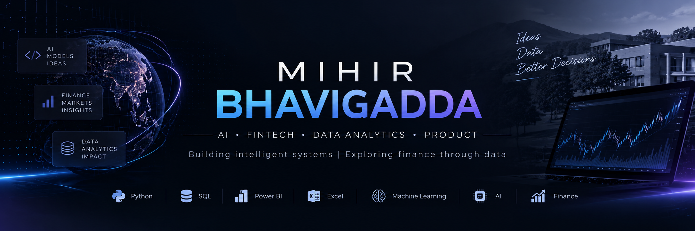

<p align="center">
  
</p>

<h1 align="center">Hi, I'm Mihir Bhavigadda </h1>

<p align="center">
  <strong>AI • FinTech • Data Analytics • Product</strong>
</p>

<p align="center">
  Building intelligent systems, exploring financial technology,
  and turning data into actionable insights.
</p>

<p align="center">
  <a href="https://github.com/mihirb1411-netizen">
    
  </a>
</p>

---

## 👨‍💻 About Me

I'm an AI-focused business student interested in the intersection of:

- 🤖 Artificial Intelligence & Machine Learning
- 💰 FinTech & Financial Analytics
- 📊 Data Analytics & Business Intelligence
- 📈 Markets, Portfolio Analysis & Decision Science
- 🚀 Building practical, data-driven products

I enjoy taking an idea from **concept → data → model → analysis → working product**.

Currently, I'm focused on building projects that combine **AI, finance, analytics, and business strategy**.

---

## 🧠 What I Work With

### Programming & Data

<p>
  
  
  
</p>

### Analytics & AI

<p>
  
  
  
</p>

### Tools & Platforms

<p>
  
  
  
  
</p>

---

# 🚀 Featured Projects

## 🤖 ShopSphere — AICV TabTransformer

**Algorithm-Induced Customer Churn Volatility**

An AI-driven project designed to analyze sudden changes in customer churn associated with external platform algorithm shifts.

### Core Concept

> **AICV = Post-Algorithm Churn Rate / Historical Baseline Churn Rate**

The project combines:

- TabTransformer architecture
- Synthetic financial/customer datasets
- Feature engineering
- Model training & evaluation
- Customer churn analysis
- KPI development
- Interactive AI demonstration

**Tech:** `Python` `Machine Learning` `TabTransformer` `Hugging Face` `Data Analytics`

---

## 🧠 NLP — Sentiment Analysis

A Natural Language Processing project focused on extracting sentiment and patterns from textual data.

### Work includes

- Text preprocessing
- Tokenization
- Feature extraction
- Sentiment classification
- Model evaluation
- Exploratory analysis

**Tech:** `Python` `Jupyter Notebook` `NLP` `Machine Learning`

---

## 🍽️ Restaurant Pricing & Promotion Analytics

A data analytics project focused on understanding restaurant pricing, promotions, cuisine-level positioning, and competitor pricing.

### Analysis areas

- Menu pricing
- Cuisine-level price differences
- Competitor benchmarking
- Promotion effectiveness
- Price positioning
- Customer-facing pricing insights
- Data-driven promotional strategy

**Tech:** `Python` `Pandas` `Matplotlib` `Data Analysis` `Business Intelligence`

---

# 📊 Analytics Interests

I'm particularly interested in using data to answer questions such as:

```text
Business Question
       ↓
     Data
       ↓
Exploratory Analysis
       ↓
Statistical / ML Model
       ↓
Visualization
       ↓
Business Insight
       ↓
     Decision

<!--
**mihirb1411-netizen/mihirb1411-netizen** is a ✨ _special_ ✨ repository because its `README.md` (this file) appears on your GitHub profile.

Here are some ideas to get you started:

- 🔭 I’m currently working on ...
- 🌱 I’m currently learning ...
- 👯 I’m looking to collaborate on ...
- 🤔 I’m looking for help with ...
- 💬 Ask me about ...
- 📫 How to reach me: ...
- 😄 Pronouns: ...
- ⚡ Fun fact: ...
-->
